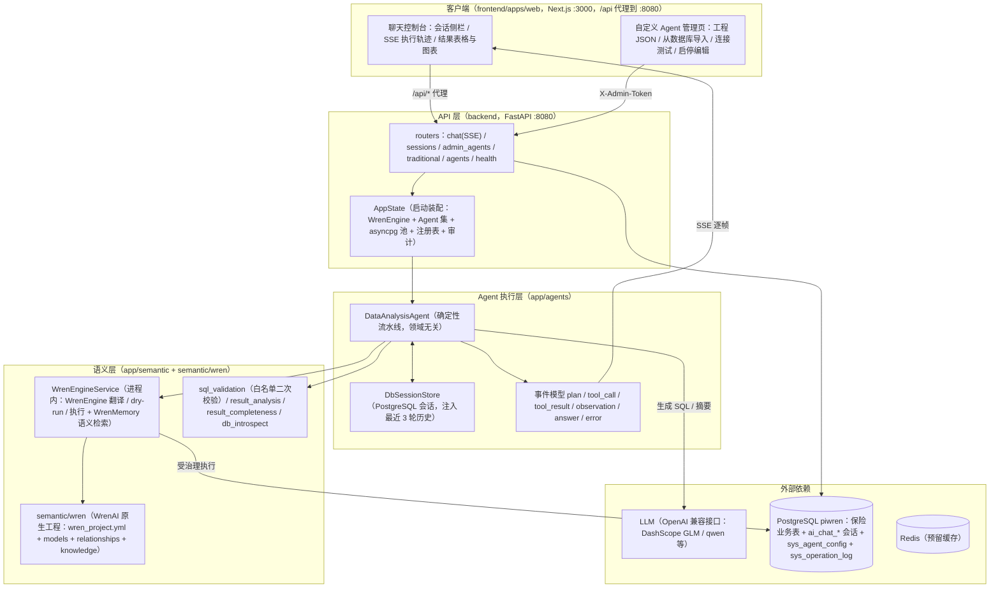

# pi-wren-platform 架构

> 📌 2026-08 架构快照（`refactor/embrace-wrenai-drop-mdl` 重构后）：后端为 **Python（FastAPI + WrenAI 进程内 SDK + LangChain）**，语义层完全基于 **WrenAI 原生工程**。
> 旧版 TS 后端（Express）、pi-bridge 会话层、自研 MDL 与规则兜底引擎均已退役；[technical-architecture.md](technical-architecture.md) 为 TS 时期的历史快照。

## 设计原则

1. **确定性流水线优先**：LLM 只承担"生成 SQL"与"结果摘要"两个受控环节，工具编排固定，不引入 LLM 自由循环——企业级可靠性的核心决策。
2. **语义层单一来源**：WrenAI 原生工程（`semantic/wren/`）是唯一语义格式，无自研 MDL、无规则模板兜底；语义检索、SQL 翻译、受治理校验全部交给 WrenAI。
3. **Agent 领域无关**：一条通用流水线（`DataAnalysisAgent`），领域差异全部来自 domain 配置 + 注入的语义工程——新增 Agent 不改流水线代码。

## 运行时架构（分层）



## 目录结构

前后端各自独立成目录；**全部前端工具链配置集中在 `frontend/`（pnpm workspace 根）**，仓库根只保留与栈无关的资产（语义工程/基础设施/文档）。

```text
pi-wren-platform/
├── backend/                      # Python 后端（FastAPI + WrenAI 进程内 SDK）
│   ├── app/
│   │   ├── main.py               # 入口：日志/认证中间件/异常处理/路由注册
│   │   ├── config.py             # pydantic-settings 环境配置（读 .env）
│   │   ├── deps.py               # 组合根：启动装配 AppState（只装配，不含业务）
│   │   ├── llm.py                # LLM 构建（OpenAI 兼容，qwen 禁思考等适配）
│   │   ├── metrics.py            # 进程指标（Prometheus 文本，/api/metrics 暴露）
│   │   ├── ratelimit.py          # 滑动窗口限流（聊天/登录）
│   │   ├── agents/               # DataAnalysisAgent 确定性流水线 + 领域配置
│   │   ├── auth/                 # 认证：中间件/PBKDF2/HMAC 令牌/用户表/admin 依赖
│   │   ├── routers/              # HTTP 路由：chat(SSE)/sessions/auth/admin_*/traditional/health
│   │   ├── semantic/             # 语义层：wren_engine(池化)/sql_validation/分析/DB 内省
│   │   ├── registry/             # 自定义 Agent：存储/AES 加密/注册表/审计/工厂
│   │   ├── session/              # 会话存储（PostgreSQL ai_chat_* 两表，user_id 归属）
│   │   ├── insurance/            # 传统查询服务（手写 SQL 的固定报表接口）
│   │   ├── models/               # Pydantic 契约（与 frontend/packages/shared-types 对应）
│   │   └── data/                 # asyncpg 连接池（只读 + 可写）
│   ├── tests/                    # pytest：纯函数 + Fake 池 + golden SQL 回归集
│   ├── pyproject.toml            # 依赖与 pytest 配置
│   └── Dockerfile
├── frontend/                     # TypeScript 工作区（pnpm workspace 根，配置集中于此）
│   ├── package.json              # workspace 根清单 + 统一 scripts（dev/build/lint/test）
│   ├── pnpm-workspace.yaml       # 工作区包定义 + pnpm 11 构建白名单（allowBuilds）
│   ├── pnpm-lock.yaml
│   ├── tsconfig.base.json        # TS 严格模式基线（apps/web 与 shared-types 均 extends）
│   ├── eslint.config.mjs / .prettierrc.json / .npmrc
│   ├── .dockerignore             # web 镜像构建上下文白名单
│   ├── apps/
│   │   └── web/                  # Next.js 控制台：chat / agents / users / login / query
│   │       └── Dockerfile        # 生产镜像（上下文 = frontend/）
│   └── packages/
│       └── shared-types/         # 前后端共享契约类型（后端不消费）
├── semantic/wren/                # WrenAI 原生语义工程（唯一语义源；target/ 与 .wren/ 为构建产物，已忽略）
├── infra/postgres/               # 建表与种子数据（docker init 按文件名序自动执行）
├── examples/                     # 自定义 Agent 工程模板（wren-project-template.json）
├── docs/                         # 架构/路线图/设计文档
├── docker-compose.yml            # 本地开发基础设施（PostgreSQL/Redis）
├── docker-compose.prod.yml       # 生产编排（postgres/redis/backend/web 四服务）
├── docker-compose.prod.local.yml # 本地演示覆盖（web 端口 31000）
├── .env / .env.example           # 环境配置（pydantic-settings 自动加载）
├── AGENTS.md                     # 贡献者指南
└── README.md
```

约定：改前端只在 `frontend/` 内操作（`pnpm dev/build/lint/test` 均在此执行）；改后端在 `backend/` 内操作；仓库根不放任何栈专属代码。

## 模块清单

| 模块 | 职责 | 关键实现 |
|---|---|---|
| `backend/app/routers` | 对外 API | `chat`（JSON + SSE 流式）、`sessions`（会话 CRUD，按用户归属隔离）、`auth`（登录/登出/me）、`admin_agents`（自定义 Agent 管理，admin 角色或 `X-Admin-Token`）、`traditional`（传统保单/理赔/保全查询）、`agents`、`health` |
| `backend/app/auth` | 用户认证 | `middleware`（守护 `/api/*`）、`passwords`（PBKDF2）、`tokens`（HMAC 会话令牌）、`store`（`sys_login_user` 表，60s 用户缓存） |
| `backend/app/agents` | Agent 流水线 | `data_analysis.py`（`DataAnalysisAgent`：计划→SQL→查询→自检→分析→摘要）、`domain.py`（领域配置，当前内置保险） |
| `backend/app/semantic` | 语义层 | `wren_engine.py`（WrenEngine/WrenMemory 进程内封装）、`mdl_loader.py`（表名白名单）、`sql_validation.py`（SQL 解析 + 白名单）、`result_analysis.py` / `result_completeness.py`（启发式分析 / 缺字段自检）、`db_introspect.py`（数据库内省生成工程 JSON） |
| `backend/app/registry` | 自定义 Agent 注册表 | `store.py`（`sys_agent_config` 持久化）、`crypto.py`（连接串 AES-256-GCM 加密）、`agent_registry.py`（运行时热加载/启停/隔离）、`audit.py`（`sys_operation_log` 审计，失败不阻断） |
| `backend/app/session` | 会话存储 | `db_store.py`（PostgreSQL `ai_chat_session` + `ai_chat_message`，`user_id` 归属隔离） |
| `backend/app/data` + `insurance` | 数据访问 | asyncpg 只读池 + 可写池、`InsuranceQueryService`（传统查询手写 SQL） |
| `frontend/apps/web` | 前端控制台 | 聊天页（ThinkingStream / TracePanel / ChatResultTable / ChatChart / SessionSidebar）、Agent 管理页 |
| `frontend/packages/shared-types` | 前端共享类型 | AgentEvent、AgentRunResult 等契约（后端不消费） |
| `semantic/wren` | WrenAI 原生工程 | schema_version 5：`wren_project.yml` + `models/*/metadata.yml`（7 个模型）+ `relationships.yml` + `knowledge/{rules,sql}` |
| `infra/postgres` | 数据初始化 | `insurance_schema.sql`（22 张生产级表 + ai_chat 会话表）+ 种子数据 + `agent_config.sql`（自定义 Agent 表）+ `auth_schema.sql`（登录用户表）+ `z_admin_seed.sql`（审计主体） |
| `examples/` | 工程模板 | `wren-project-template.json`（自定义 Agent 工程模板） |

## 一次问答的数据流

`DataAnalysisAgent.answer()`（`backend/app/agents/data_analysis.py`）：

```
用户提问 "各险种的赔付率如何？"
 → ① plan：理解业务问题（注入会话最近 3 轮历史）
 → ② WrenAI 语义检索：WrenMemory 检索相关表/列/相似查询 + knowledge/rules 业务规则注入
 → ③ LLM 生成只读 SQL（受治理提示词，max_tokens=2000，多表 JOIN 不截断）
 → ④ 本地二次校验：sql_validation 解析 + 只读约束 + 表名白名单（来自 MDL models）
 → ⑤ WrenAI dry-run 受治理校验（解析 + 合法 + 仅工程内表）   ← 失败带错误提示重试，最多 2 次
 → ⑥ 经 WrenEngine 翻译执行（MDL 逻辑 SQL → PostgreSQL 物理 SQL）
 → ⑦ 结果完整性自检：用户要的字段没查到 → 构造补齐问题重新生成（最多 1 次）
 → ⑧ 启发式分析（分组占比 / 环比 / 时间序列）
 → ⑨ LLM 防幻觉摘要（日期数值逐字照抄，缺失字段声明"未包含"）
 → ⑩ 落库会话（ai_chat_session + ai_chat_message），SSE 逐帧推送事件 + done 携带完整结果
```

事件模型（`plan/tool_call/tool_result/observation/answer/error`）驱动前端执行轨迹实时展示；LLM 摘要失败自动降级为确定性分析结果。

## 语义层：WrenAI 原生工程

- **工程结构**（`semantic/wren/`，schema_version 5）：`wren_project.yml`（数据源 postgres/public）+ `models/{ins_policy_main, ins_claim_main, ins_customer, ins_policy_underwrite, ins_preserve_main, sys_dict, sys_org}/metadata.yml` + `relationships.yml`（模型间关系）+ `knowledge/rules/`（中文业务规则）+ `knowledge/sql/`（示例查询，供语义检索）。
- **`WrenEngineService`**（`wren_engine.py`）进程内封装，无子进程、无 HTTP：
  - `WrenEngine`：MDL→物理 SQL 翻译（`dry_plan`）、受治理校验（`dry_run`）、执行（`query`）
  - `WrenMemory`：基于 Lance 向量索引的语义检索（`fetch_context`），失败降级为业务规则全文
- **启用前置**：`.env` 配置 `WREN_PROJECT_DIR`；在 `semantic/wren` 下执行 `wren context build`（产出 `target/mdl.json`，引擎与白名单都读它）与 `wren memory index`。服务器部署需 `pip install 'wrenai[postgres,memory]'`，国内配 `HF_ENDPOINT=https://hf-mirror.com` 下载 embedding 模型。

## 内置 Agent 与自定义 Agent

两者走**同一条流水线**，这是平台的扩展模型：

- **内置 Agent**：`domain.py` 加一段领域配置 + `semantic/wren/` 一份工程，启动时装配进 `AppState`（当前仅保险）。
- **自定义 Agent**（`AGENT_SECRET_KEY` 配置后启用）：
  - 注册：管理页/API 提交 WrenAI 工程 JSON + 数据库连接串 → 工程 JSON 落库 `sys_agent_config.project_json`，连接串 AES-256-GCM 加密
  - 运行：`AgentRegistry` 启动加载 + 运行时热增删（无需重启），每个自定义 Agent 独立 WrenEngine 轮询池（`registry/factory.py`）+ 独立 LLM 实例，表名白名单自动取自工程 models 的 `tableReference`；单个 Agent 加载失败仅标记 `status=error`，不影响其他 Agent
  - 快捷方式：`POST /api/admin/agents/import-from-db` 内省 `information_schema`/`pg_catalog` 自动生成工程 JSON 回填表单（`db_introspect.py`，纯生成不落库）
  - 治理：`owner_id` 归属；注册/更新/启停/注销写审计 `sys_operation_log`；`/status` 端点暴露启停与错误状态

## 会话存储

`DbSessionStore`（`session/db_store.py`）：PostgreSQL 两表模型——`ai_chat_session`（会话主表，含 `agent_id` 隔离与 `user_id` 归属）+ `ai_chat_message`（每轮问题/回答/SQL/结果 JSON）。多轮续聊注入最近 3 轮历史；会话列表/重命名/删除经 `/api/sessions*` 管理。

## 引擎池与限流

- **WrenEngine 引擎池**：`WrenEngineService` 与自定义 Agent 的 `_WrenEngineAdapter` 均为 N 引擎轮询（`AI_ENGINE_POOL_SIZE`，默认 4，每引擎一条懒创建的 psycopg 连接），消除单连接串行瓶颈；WrenMemory 只读单实例共享。
- **限流**：`app/ratelimit.py` 进程内滑动窗口——聊天按 用户/IP（`RATE_LIMIT_CHAT_PER_MIN`，默认 12/分钟）、登录按 IP（`RATE_LIMIT_LOGIN_PER_MIN`，默认 10/分钟），超限 429 + Retry-After；0 关闭。多副本部署需换 Redis 等共享存储。

## API 一览

| 分组 | 端点 |
|---|---|
| 问答 | `POST /api/agent/chat`（默认 Agent）· `POST /api/agent/{domain}/chat` · `POST /api/agent/{domain}/chat/stream`（SSE） |
| Agent | `GET /api/agents`（内置 + 自定义） |
| 会话 | `GET /api/sessions` · `GET/PUT/DELETE /api/sessions/{id}` |
| 自定义 Agent 管理 | `GET/POST /api/admin/agents` · `GET/PUT/DELETE /api/admin/agents/{id}` · `GET /api/admin/agents/{id}/status` · `POST /api/admin/agents/test`（连接测试）· `POST /api/admin/agents/{id}/test` · `POST /api/admin/agents/validate-project` · `POST /api/admin/agents/import-from-db` |
| 传统查询 | `POST /api/traditional/contract/query|export` · `POST /api/traditional/claim/query` · `POST /api/traditional/preserve/query` · `GET /api/traditional/{contract|claim|preserve}/{id}/detail` · `GET /api/dicts` · `GET /api/orgs` |
| 健康与指标 | `GET /api/health` · `GET /health` · `GET /api/metrics`（Prometheus 文本，admin 可见） |

## 安全模型

- **SQL 三道闸**：生成层（系统提示词强制只读 SELECT/WITH）→ 校验层（`sql_validation`：剥离注释/拦截危险语句/表名白名单，**写语句在此拦截**）→ WrenAI dry-run（**strict mode 默认开启**：fail-closed 表白名单 + `read_csv`/`dblink` 等数据外读函数拦截；`WREN_STRICT_MODE` 可关。wren 0.13.x 的 strict mode 不查语句类型，故写拦截依赖本地层）。升级 wrenai 后运行 `backend/tests/test_golden_sql.py`（真实 MDL dry_plan 回归集）确认翻译行为未回归。
- **执行硬约束**：查询行数上限（`AI_QUERY_ROW_LIMIT`，默认 500，超限截断并在回答中提示）+ 语句超时（`AI_QUERY_TIMEOUT_SECONDS`，默认 30s，经 libpq options 注入 wren 连接器）。
- **限流**：聊天接口按 用户/IP 滑动窗口（`RATE_LIMIT_CHAT_PER_MIN`，默认 12/分钟，LLM 成本防护）；登录接口按 IP（`RATE_LIMIT_LOGIN_PER_MIN`，默认 10/分钟，防暴力破解）。进程内存实现，多副本需换共享存储。
- **用户认证与用户管理**（`AUTH_ENABLED=true` 时启用，生产必须开启）：`AuthMiddleware` 守护全部 `/api/*`（登录/健康检查除外）；PBKDF2 口令（`sys_login_user` 表）+ HMAC 签名会话 Cookie（HttpOnly/SameSite=Lax，默认 12h）；初始管理员由 `AUTH_ADMIN_PASSWORD` 首启引导创建（不设弱默认口令）。前端 `apiFetch` 统一 401 跳转 `/login`。用户管理（`/api/admin/users` + `/users` 页面，仅 admin）：创建/改角色/启停/重置口令，含自我保护（不能停用/降级自己）与最后活跃管理员保护，全部操作审计。
- **会话归属（防 IDOR）**：`ai_chat_session.user_id` 记录归属；列表/回看/重命名/删除按本人过滤，admin 可见全部（含认证前的历史会话 owner=NULL）。
- **连接串加密**：`AGENT_SECRET_KEY`（≥8 位）驱动 AES-256-GCM，未配置则禁用自定义 Agent 功能。
- **管理面鉴权**：`/api/admin/*` 接受登录会话（role=admin）或 `X-Admin-Token`（与 `ADMIN_TOKEN` 比对，未配置一律拒绝）。
- **审计**：管理操作（注册/启停/删除）+ 登录 + **AI 问答**（谁问了什么、生成了什么 SQL、来源 IP）均写 `sys_operation_log`，失败不阻断业务。
- **可观测性**：进程内指标经 `GET /api/metrics` 暴露（Prometheus 文本格式：chat 计数/时延直方图、SSE 断连计数、进程存活时长）；AUTH_ENABLED 时仅 admin 可见。
- **输入防护**：`sessionId` 正则白名单（防路径穿越），消息长度 1–4000 字符。

## 配置与本地开发

- 配置：仓库根 `.env`（pydantic-settings 自动加载，参考 `.env.example`）。关键项：`OPENAI_API_KEY`/`OPENAI_BASE_URL`/`OPENAI_MODEL`（LLM 统一走 OpenAI 兼容接口，qwen 系列自动禁用 thinking）、`WREN_PROJECT_DIR`、`ADMIN_TOKEN`、`AGENT_SECRET_KEY`、`DB_*`。
- 基础设施：`docker compose up -d` 起 PostgreSQL（demo/demo，库 piwren，初始化脚本挂载 `infra/postgres`）与 Redis（预留）。
- 容器化部署：`backend/Dockerfile` + `frontend/apps/web/Dockerfile` + `docker-compose.prod.yml`（postgres/redis/backend/web 四服务，semantic 工程只读挂载，web 经 `NEXT_PUBLIC_API_URL` 指向 backend）。
- 后端：`pip install -e backend[dev]` → `uvicorn app.main:app --port 8080 --reload`（`backend/` 内）。
- 前端：`pnpm install` → `pnpm dev`（仅起 :3000，后端需单独起）。
- 测试：`pytest backend/tests`（纯函数测试为主，无 DB fixture）/ `pnpm test`（Vitest）。

## 当前边界与演进方向

**已可用**：自然语言查真实数据库 + 业务分析摘要（保险 Agent）、SSE 流式执行轨迹、PostgreSQL 多轮会话、用户认证 + 会话归属隔离 + 用户管理（`AUTH_ENABLED`）、AI 问答审计、查询行数/超时硬约束、WrenAI strict mode + golden SQL 回归集、WrenEngine 引擎池（内置 + 自定义 Agent）、限流（聊天/登录）、基础指标暴露（`/api/metrics`）、容器化部署物、自定义 Agent 全生命周期（注册/启停/编辑/删除/连接测试/从数据库导入）、传统查询接口。

**待加固**（详见 [enterprise-roadmap.md](enterprise-roadmap.md)）：

- 数据权限（行级/列级、机构维度数据隔离；当前认证只做身份 + 会话归属）
- 多副本部署（限流器/指标为进程内存，自定义 Agent 运行时注册不跨进程广播）
- LLM 摘要 token 级流式（执行事件流已完成）
- 数据库迁移工具（Alembic；当前为 init 脚本 + 启动自愈建表）
