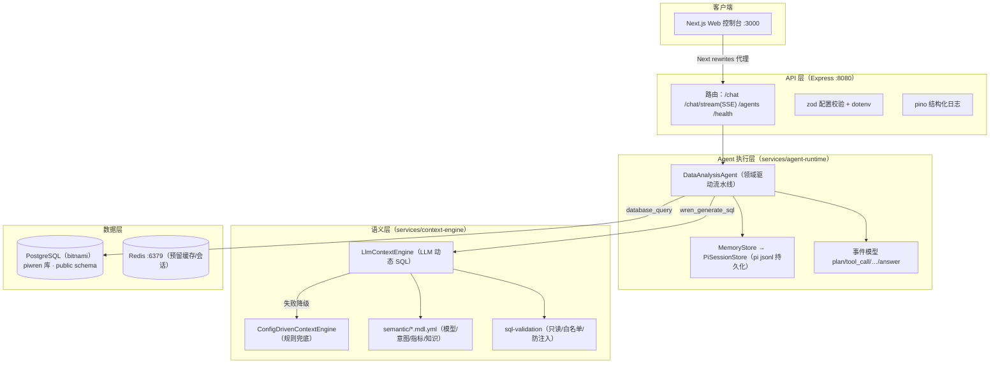

# 技术架构说明（结果版）

> 截至 2026-08 的架构快照：企业级自然语言数据问答平台（pi-wren-platform）。
> 与 [architecture.md](architecture.md)（演进版）互补，本文聚焦当前已落地结构的最终形态。

## 一、总体架构（分层）



## 二、模块清单（pnpm workspace，9 包）

| 模块 | 职责 | 关键实现 |
|---|---|---|
| `apps/web` | 聊天控制台 | Next.js 15、**SSE 实时轨迹**、多 Agent 切换、结果表 |
| `apps/api` | 对外 API | Express 5、SSE 端点、zod 配置、优雅停机、tsup **CJS 生产构建** |
| `services/agent-runtime` | Agent 流水线 | `DataAnalysisAgent`：计划→SQL→查询→分析→摘要；`sessionId` 续聊 + 历史注入 |
| `services/context-engine` | 语义层 | MDL 解析、LLM 动态 SQL、规则兜底、Wren AI 客户端 |
| `services/data-engine` | 数据引擎 | pg 连接池、`SqlExecutor` 抽象 |
| `services/pi-bridge` | **开源 Pi 会话层（方案 A）** | `PiSessionStore`（jsonl 持久化）、压缩决策、SSE 协议 |
| `packages/agent-sdk` | LLM Provider | OpenAI 兼容（DashScope）/ Anthropic / Ollama / Mock |
| `packages/shared-types` | 跨服务契约 | AgentEvent、AgentRunResult、ChatMessage 等 |
| `infra/postgres` | 数据初始化 | 建表 + 种子（保险 22 张生产级表 + 财务 demo） |

## 三、一次问答的数据流

```
用户提问"王大力都有哪些保单？"
 → ① plan：Agent 生成执行计划
 → ② 语义层生成 SQL（LLM 注入表结构/知识/示例；失败降级规则引擎）
 → ③ SQL 安全校验（仅 SELECT/WITH、拦截高危语句、表名白名单）
 → ④ PostgreSQL 执行（连接池）
 → ⑤ 结果分析（分组占比/环比）
 → ⑥ LLM 防幻觉摘要（日期/数值逐字照抄，缺失字段声明"未包含"）
 → ⑦ SSE 逐帧推送事件 + done（历史写入 pi jsonl 会话）
```

## 四、关键机制与技术选型

- **确定性流水线优先**：LLM 只做"SQL 生成"和"摘要"两个受控步骤，工具编排固定，**不引入 LLM 自由循环**（接入开源 Pi 时的核心架构决策）
- **安全三层**：生成层（只读约束）→ 校验层（`sql-validation`）→ 执行层（连接池；硬约束待加固）
- **多轮会话**：基于开源 Pi `JsonlSessionRepo` 落盘 `data/sessions/`，重启不丢；摘要注入最近 3 轮历史
- **流式输出**：`POST /api/agent/:domain/chat/stream`（SSE + 心跳）；前端实时渲染执行轨迹
- **生产构建**：tsup **CJS 单文件**（ESM bundle 无法兼容 pg/yaml 等原生 CJS 依赖，此为既有隐患的修复）
- **运行依赖**：PostgreSQL（bitnami 镜像，`demo/demo`）、Redis（预留）、DashScope qwen3.7-flash（OpenAI 兼容）
- **质量**：Vitest 55 用例（Provider/校验/意图/Agent 流水线/API 集成/会话存储）、GitHub CI、lint/typecheck 全绿

## 五、当前边界与演进方向

### 已可用
- 自然语言查真实数据库 + 业务分析摘要（财务 / 保险双 Agent）
- SSE 流式输出（执行事件实时推送）
- 多轮会话续聊（pi jsonl 持久化 + 历史注入）

### 待加固（上线前必做）
- 身份认证与授权（API key / JWT / RBAC）
- 审计日志落库（`sys_operation_log`）
- SQL 执行层硬约束（只读事务、行数上限、超时）

### 演进方向
- 混合路由提速：常见问题走规则快路径（<1s），仅新问题走 LLM（当前单问 20–50s）
- LLM 摘要 token 级流式输出（执行事件流已完成）
- 传统业务查询界面（需求文档第 3 章）
- 容器化生产部署（API/Web Dockerfile + 编排）
- 会话历史注入 SQL 生成上下文（当前仅注入摘要）
