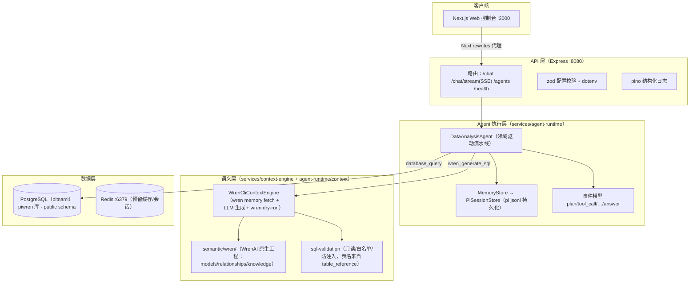

# 技术架构说明（结果版）

> 截至 2026-08 的架构快照：企业级自然语言数据问答平台（pi-wren-platform）。
> 与 [architecture.md](architecture.md)（演进版）互补，本文聚焦当前已落地结构的最终形态。

## 一、总体架构（分层）



## 二、模块清单（pnpm workspace，9 包）

| 模块 | 职责 | 关键实现 |
|---|---|---|
| `apps/web` | 聊天控制台 + 管理页 | Next.js 15、**SSE 实时轨迹**、多 Agent 切换、结果表、`/agents` 自定义 Agent 管理页（WrenAI 工程 JSON/连接测试/启停/编辑/池监控） |
| `apps/api` | 对外 API | Express 5、SSE 端点、zod 配置、优雅停机、tsup **CJS 生产构建** |
| `services/agent-runtime` | Agent 流水线 | `DataAnalysisAgent`：计划→SQL→查询→分析→摘要；`WrenCliContextEngine`（唯一语义层）；`sessionId` 续聊 + 历史注入 |
| `services/context-engine` | 语义层 | WrenAI CLI 子进程适配器（`WrenCli`）+ WrenAI 工程加载器（`loadWrenProject`，提取表名白名单与 NL→SQL 示例） |
| `services/data-engine` | 数据引擎 | pg 连接池、`SqlExecutor` 抽象 |
| `services/pi-bridge` | **开源 Pi 会话层** | `PiSessionStore`（jsonl 持久化）、压缩决策、SSE 协议 |
| `services/agent-registry` | **自定义 Agent 注册表** | `sys_agent_config`（`project_json` 列）持久化、AES-256-GCM 连接串加密、运行时动态加载/更新/注销、错误隔离、审计、连接池监控 |
| `packages/agent-sdk` | LLM Provider | OpenAI 兼容（DashScope）/ Anthropic / Ollama / Mock |
| `packages/shared-types` | 跨服务契约 | AgentEvent、AgentRunResult、ChatMessage 等 |
| `infra/postgres` | 数据初始化 | 建表 + 种子（保险 22 张生产级表 + `sys_agent_config` + `sys_operation_log` 审计 + UADMIN） |

## 三、一次问答的数据流

```
用户提问"王大力都有哪些保单？"
 → ① plan：Agent 生成执行计划
 → ② WrenAI 语义检索（wren memory fetch 注入表结构/相似查询；wren context instructions 注入业务规则）→ LLM 生成 SQL
 → ③ wren dry-run 受治理校验 + 本地 sql-validation 安全校验（database_query 统一关口：去注释/危险函数拦截/表名白名单来自 table_reference）
 → ④ PostgreSQL 执行（连接池）
 → ⑤ 结果分析（分组占比/环比）
 → ⑥ LLM 防幻觉摘要（日期/数值逐字照抄，缺失字段声明"未包含"）
 → ⑦ SSE 逐帧推送事件 + done（历史写入 pi jsonl 会话；管理操作写入审计）
```

## 四、关键机制与技术选型

- **确定性流水线优先**：LLM 只做"SQL 生成"和"摘要"两个受控步骤，工具编排固定，**不引入 LLM 自由循环**（接入开源 Pi 时的核心架构决策）
- **完全拥抱 WrenAI**：语义层单一来源为 WrenAI 原生工程（`semantic/wren/`），`WrenCliContextEngine` 通过 `wren memory fetch` 检索语义 + `wren dry-run` 受治理校验；不再有自研 MDL 或确定性规则兜底，LLM 不可用时问答失败
- **安全三层**：生成层（只读约束 + wren dry-run）→ 校验层（`sql-validation`，database_query 统一关口：字符串占位/注释剥离/危险函数拦截/表名白名单来自 `loadWrenProject` 的 `table_reference`）→ 执行层（数据库层只读事务、语句超时、行数上限）
- **多轮会话**：基于开源 Pi `JsonlSessionRepo` 落盘 `data/sessions/`，重启不丢；摘要注入最近 3 轮历史
- **流式输出**：`POST /api/agent/:domain/chat/stream`（SSE + 心跳）；前端实时渲染执行轨迹
- **自定义 Agent**：用户提交 WrenAI 工程 JSON + 数据库连接串即注册（`/api/admin/agents`）；工程 JSON 落库 `project_json`、连接串 AES-256-GCM 加密、表名白名单自动来自工程的 `table_reference`、独立连接池（max 3/15s 超时）
- **多租户与审计**：`owner_id` 归属与过滤；注册/更新/启停/注销写入 `sys_operation_log`（失败不阻断业务）
- **连接池监控**：`AgentPoolManager` 按 Agent 统计 total/idle/waiting，更新/注销时自动释放
- **生产构建**：tsup **CJS 单文件**（ESM bundle 无法兼容 pg/yaml 等原生 CJS 依赖，此为既有隐患的修复）
- **运行依赖**：PostgreSQL（bitnami 镜像，`demo/demo`）、Redis（预留）、WrenAI CLI（`wrenai[postgres,memory]`）、DashScope qwen3.7-flash（OpenAI 兼容）
- **质量**：Vitest 用例覆盖 SQL 校验对抗性用例、WrenAI 工程加载器、会话存储、注册表/审计、管理 API 集成；GitHub CI、lint/typecheck 全绿

## 五、当前边界与演进方向

### 已可用
- 自然语言查真实数据库 + 业务分析摘要（财务 / 保险双 Agent）
- SSE 流式输出（执行事件实时推送）
- 多轮会话续聊（pi jsonl 持久化 + 历史注入）

### 待加固（上线前必做）
- 身份认证与授权（API key / JWT / RBAC，当前管理面为轻量 `X-Admin-Token`）
- SQL 执行层硬约束（只读事务、行数上限）；AI 问答审计接入（管理操作审计已完成）
- 自定义 Agent 的 owner 权限校验（当前 owner 由请求方声明）

### 演进方向
- 混合路由提速：常见问题走规则快路径（<1s），仅新问题走 LLM（当前单问 20–50s）
- LLM 摘要 token 级流式输出（执行事件流已完成）
- 传统业务查询界面（需求文档第 3 章）
- 容器化生产部署（API/Web Dockerfile + 编排）
- 会话历史注入 SQL 生成上下文（当前仅注入摘要）
- 自定义 Agent 多数据源（非 PostgreSQL）、连接串托管（Vault/云密钥）
